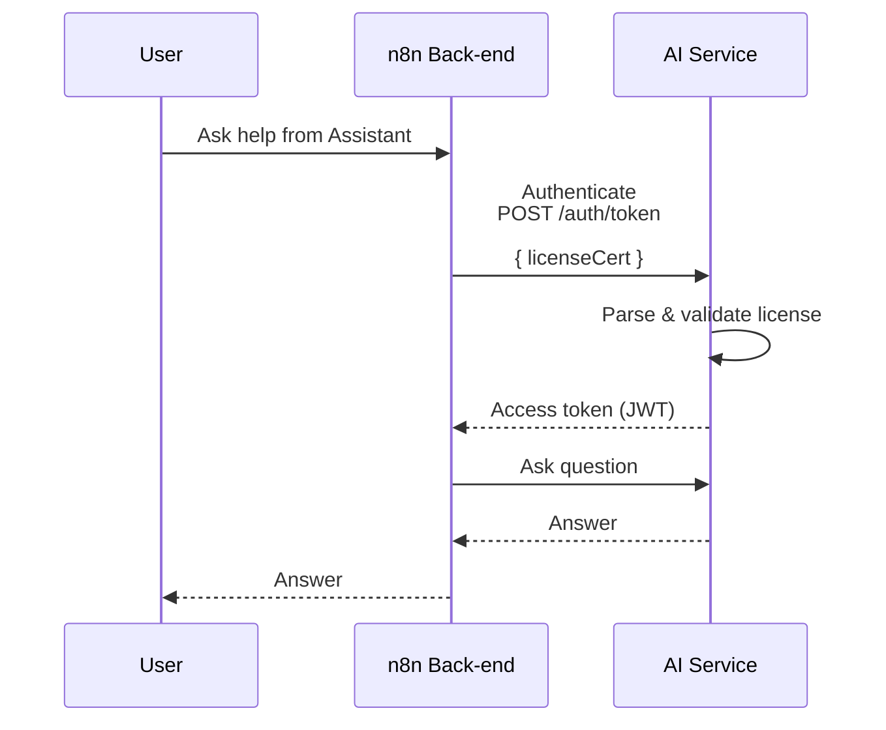

# AI Assistant Service SDK

SDK provides provides a router that handle authentication between an n8n instance and the AI service, and proxy all requests from `/rest/ai` path to the AI service.

## Communication Flow

All requests between the n8n Back-end and AI service go thought the router the sdk provides.

